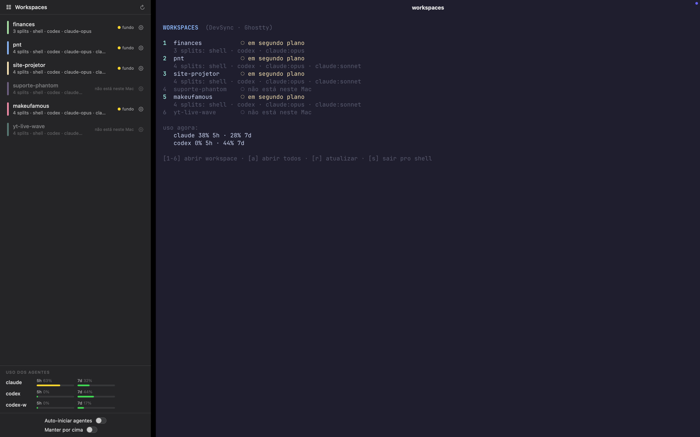

# DevSpaces

Transforma o terminal [Ghostty](https://ghostty.org) (macOS) num ambiente de workspaces por projeto: uma sidebar nativa controla abas do Ghostty com splits pré-configurados, cada split é uma sessão tmux com um agente de código (Claude Code ou Codex) armado e pronto pra disparar.



## Recursos

- **Sidebar nativa (SwiftUI)** com a lista de projetos: cor, estado (aberto / em segundo plano / fechado / não está neste Mac) e uso atual dos agentes (janelas de 5h e 7 dias, com barras).
- **Um clique abre o workspace** como aba nativa do Ghostty com o layout de splits configurado; se a aba já existe, foca em vez de duplicar.
- **Layout automático pela ordem dos splits**: 1 = tela inteira; n ≥ 2 = duas fileiras (⌊n/2⌋ em cima, resto embaixo). Sem configurar direção/parent.
- **Agentes armados, não iniciados**: cada split de agente mostra o comando configurado e espera ENTER — nada de abrir 16 agentes de uma vez num Mac de 8 GB.
- **Modelo + reasoning effort por split**, escolhidos em dropdowns alimentados dinamicamente: modelos do Claude vêm da API da conta, modelos do Codex do cache do CLI.
- **Editor visual**: cartões ordenados com preview do layout, cor do workspace, adicionar/remover/reordenar splits.
- **Ocultar workspaces** (olhinho) e **adicionar pasta como projeto** (botão +, com `git init` automático e registro no DevSync).
- **Tiling automático**: sidebar numa faixa à esquerda, Ghostty no resto da tela (API de Acessibilidade).
- **Consumo quase nulo**: o app é orientado a eventos — em segundo plano não roda timer nenhum, não spawna processo nenhum (~20 MB de RSS ocioso).
- **Cada split é uma sessão tmux** nomeada (`ghostty-<projeto>-<split>`), com barra de status própria (projeto · split · modelo·effort · uso do agente) e respawn automático se o agente morrer.

## Requisitos

- macOS 14+ (Apple Silicon)
- [Ghostty](https://ghostty.org) 1.3+
- tmux
- Xcode Command Line Tools (swiftc)
- python3 (do sistema)
- Claude Code e/ou Codex CLI para os splits de agente
- [DevSync](https://github.com/duartenews) (opcional) — registro de projetos; sem ele, edite `~/.devsync/projects` na mão (formato `nome|caminho`)

## Instalação

```sh
git clone https://github.com/duartenews/devspaces.git
cd devspaces

# 1. runtime
mkdir -p ~/bin
cp bin/devworkspace ~/bin/ && chmod +x ~/bin/devworkspace
cp bin/ws ~/bin/ && chmod +x ~/bin/ws

# 2. app
./build.zsh          # gera ~/Applications/DevSpaces.app

# 3. abrir o DevSpaces junto com o Ghostty (acrescente ao ~/.zshrc)
# if [[ "$TERM_PROGRAM" == "ghostty" ]] && ! pgrep -xq DevSpaces; then
#   open -g -a "$HOME/Applications/DevSpaces.app"
# fi
```

No primeiro uso o macOS pede duas permissões pro DevSpaces: **Automação** (controlar o Ghostty) e **Acessibilidade** (organizar as janelas lado a lado).

## Como usar

1. Abra o Ghostty — o DevSpaces abre junto e as duas janelas se organizam sozinhas.
2. Clique num workspace da sidebar: vira uma aba do Ghostty com os splits configurados.
3. Nos splits de agente, pressione **ENTER** para iniciar (ou Ctrl-C para cair num shell normal).
4. De qualquer shell: `ws <nome>` abre/foca o workspace; `devworkspace picker` abre o seletor em texto.
5. Engrenagem = editar workspace; olhinho = ocultar; **+** = adicionar uma pasta como novo projeto (o alias padrão é o nome da pasta — é o que você digita no `ws`).

## Configuração

Fonte da verdade: `~/.config/dev-workspaces/workspaces.json` (editado pelo app; `devworkspace generate` regenera o `workspaces.zsh` que o runtime consome).

```json
{
  "autostart_agents": false,
  "workspaces": [
    {
      "name": "meu-projeto",
      "color": "#89b4fa",
      "hidden": false,
      "panes": [
        {"name": "shell", "command": "shell"},
        {"name": "codex", "command": "codex", "model": "", "effort": "high"},
        {"name": "claude-opus", "command": "claude", "model": "opus", "effort": ""}
      ]
    }
  ]
}
```

`command`: `shell` | `claude` | `codex` | `codex2` | comando arbitrário. `model`/`effort` vazios = default do agente. A posição dos splits é dada pela ordem (fileira de cima esquerda→direita, depois a de baixo).

## Arquitetura

| Arquivo | Papel |
|---|---|
| `DevSpaces.swift` | app SwiftUI single-file — sidebar, editor, tiling, estados/uso |
| `bin/devworkspace` | runtime zsh — abas/splits via AppleScript, sessões tmux, `picker`, `ws`, `states`, `usage`, `models`, `generate`, `add-project` |
| `generate_workspaces.py` | gerador `workspaces.json` → `workspaces.zsh` + layout automático |
| `build.zsh` | compila e monta `~/Applications/DevSpaces.app` |
| `SPEC.md` | especificação completa |

## Avisos

- Caminhos ainda hardcoded para `/Users/Raphael` em alguns pontos — ajuste para o seu usuário ao instalar (busca e troca resolve).
- O `build.zsh` inclui um workaround (VFS overlay) para uma instalação de Command Line Tools com modulemaps duplicados; em CLT saudável ele é inócuo.
- O uso dos agentes vem da API OAuth do Claude Code (token do Keychain) e dos JSONL de sessão do Codex CLI — nada de credenciais no repo.
